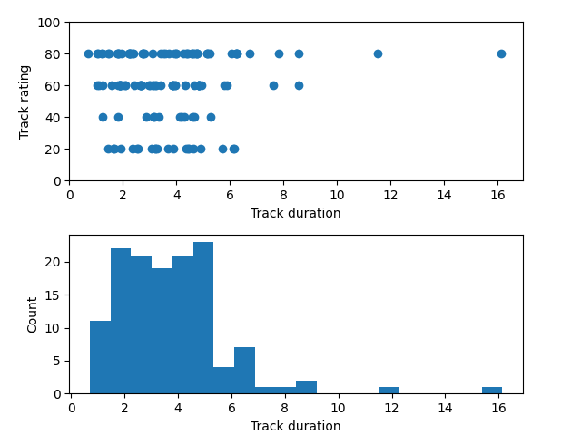

# Playlist Analysis

A Software for analyzing iTunes Playlist using XML file.


## Authors

- [@Kunal Singh](https://github.com/KunalSin9h)

  
## Running Tests

To run tests, run the following command
1. Find duplicate tracks in collection.

```bash
python main.py --dup ../raw_data/mymusic.xml
```
2. Find common tracks between playlists(files).

```bash
python main.py --common ../raw_data/pl1.xml ../raw_data/pl2.xml
```
3. Find Statistics.

```bash
python main.py --stats ../raw_data/mymusic.xml
```

### Statistics

  